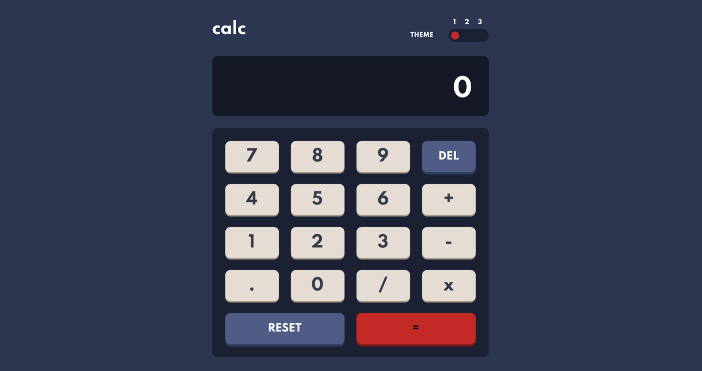

# Frontend Mentor - Calculator app solution

This is a solution to the [Calculator app challenge on Frontend Mentor](https://www.frontendmentor.io/challenges/calculator-app-9lteq5N29). Frontend Mentor challenges developers to build real projects by providing professional designs and a real-life workflow.

The challenge was to build out this calculator app and get it looking as close to the design as possible. I have chosen vanilla CSS (Flexbox and Grid) with BEM naming convention, Vanilla JavaScript and modern ES6 practices to build this project. The project was also setup with Git version control: GitHub.

## Table of contents

- [Overview](#overview)
  - [The challenge](#the-challenge)
  - [Screenshot](#screenshot)
  - [Links](#links)
- [My process](#my-process)
  - [Built with](#built-with)
  - [What I learned](#what-i-learned)
  - [Continued development](#continued-development)
- [Author](#author)

## Overview

### The challenge

Users should be able to:

- See the size of the elements adjust based on their device's screen size
- Perform mathematical operations like addition, subtraction, multiplication, and division
- Adjust the color theme based on their preference (three themes available)

### Screenshot



### Links

- Live Site URL: [Calculator App](https://calc-chris-z.netlify.app/)

## My process

### Built with

- Semantic HTML5 markup
- CSS custom properties
- BEM methodology
- Flexbox
- CSS Grid
- Mobile-first workflow

### What I learned

#### HTML & CSS Part

The calculator layout was based on the design provided by the Frontend Mentor. Classes were named according to BEM methodology. They keys on the keypad have been given classes in order to be styled in CSS, as well as custom data attributes to be later targeted in JavaScript code.

```html
<div data-type="key" data-value="*" class="key">x</div>
```

The more complex part to tackle was a theme toggle button, which also used substantial amount of code to write. I didn’t use the checkbox, since there were 3 themes to choose from. I have decided to go with radio buttons grouped in `<fieldset>` element together with the `<label>` elements. I have positions all the elements according to the design. Then, the background was added and the thumb button was animated according to the input selected with: `transform 0.2s ease-in-out` to make smooth transition. The keypad of the calculator was laid out using the CSS Grid.

```css
.calc__theme input:first-of-type:checked ~ label:last-of-type::before {
  transform: translateX(-54px);
}

.calc__theme input:nth-of-type(2):checked ~ label:last-of-type::before {
  transform: translateX(-28px);
}

.calc__theme input:last-of-type:checked ~ label:last-of-type::before {
  transform: translateX(-0.016px);
}
```

When the time to tackle the three colour schemes came, I have decided to change colours by adding theme classes using JavaScript. I decided to make three theme classes with CSS variables. Each class has the same variables names for different element e.g. background colour, display or text colour but with different values in different themes. The most important part in the process of name creation for variables, was to identify elements that will change colours.

#### JavaScript Part

The first task in the script.js file was to enable the radio button to switch themes. This was achieved by adding an event listener to them, which removed and added classes, and therefore a theme to the whole calculator container was applied.

Making calculator perform calculations was the most important part of the task. I have decided to add an event lister to every key of the keypad in order to update the display of the calculator. Special keys such as "Del" and "Reset" were given functionalities to delete one or all keys from the display. The equal sign key was given a function to calculate the current content of the display by using `eval` function of JavaScript.

```js
const calculate = (value) => {
  display.textContent
    ? (display.textContent = eval(display.textContent))
    : false;
};
```

### Continued development

In the future I would like to add keyboard events in order to enable keyboard functionality in the calculator.

## Author

- Website - [Chris Z](https://www.chris-z.dev)
- Frontend Mentor - [@Chris-Z-85](https://www.frontendmentor.io/profile/Chris-Z-85)
- Github - [@Chris-Z-85](https://github.com/Chris-Z-85)
